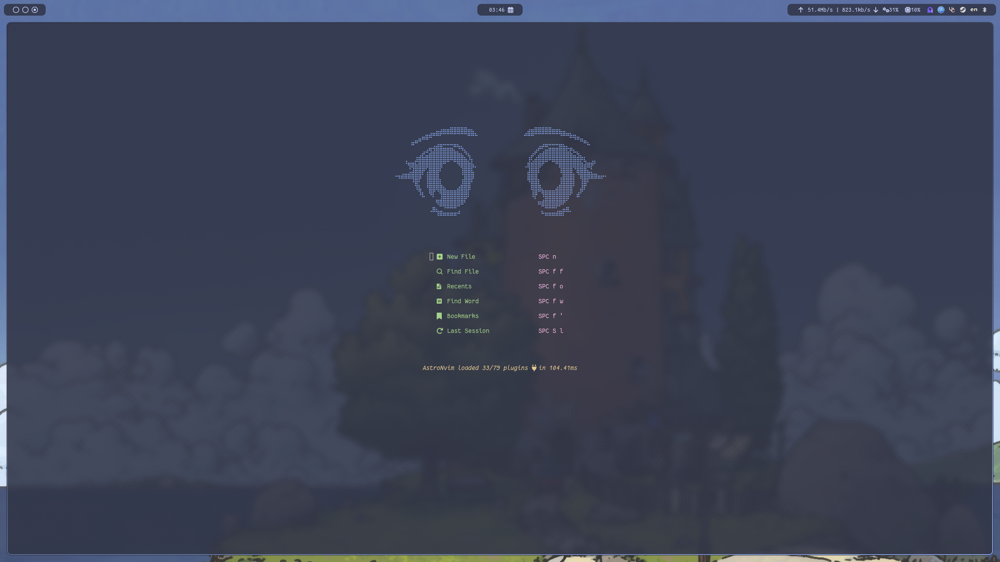
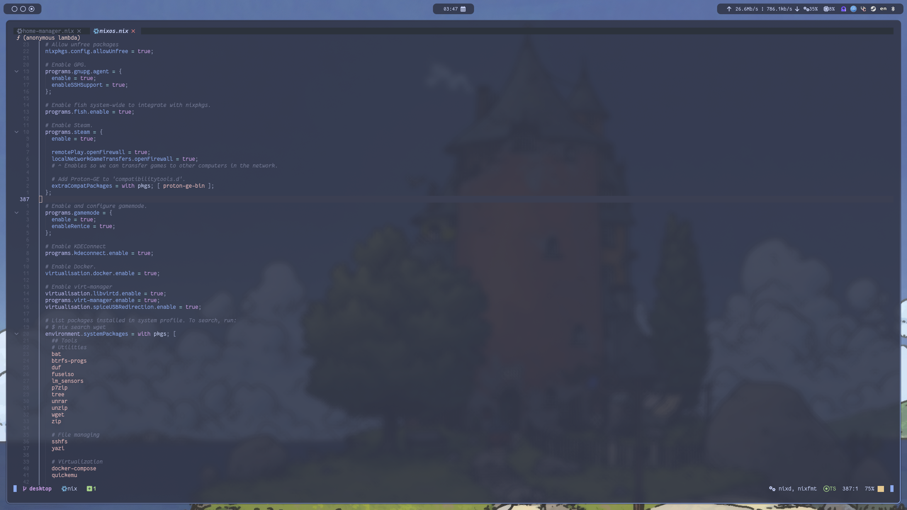
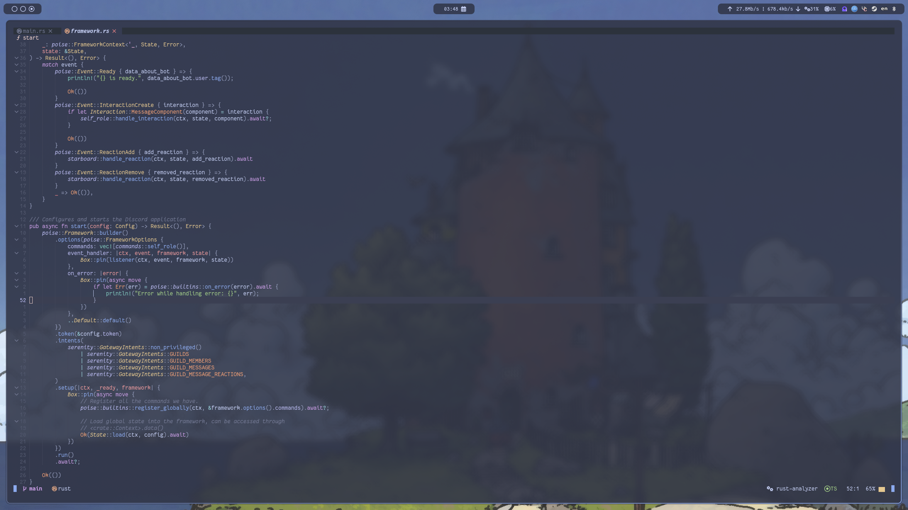

# My [Home Manager] module for neovim configuration

This is my personal configuration for _[neovim]_ using [Nix](https://nixos.org/), so this will not work outside of it - though it can be made to be.

In this case, I am outputting a [Home Manager] module to be used directly in your configuration, it currently barely has
any
options and is opinionated due to it being my personal configuration for daily use... But I plan to slowly add options
to make it usable by other people.

## Installing

First you add this repository as a flake input:

```nix
{
  inputs = {
    home-manager = {
      url = "github:nix-community/home-manager";
      inputs.nixpkgs.follows = "nixpkgs";
    };

    wizardlink.url = "git+https://git.thewizard.link/wizardlink/linuxware";
  };

  outputs = { home-manager, ... }@inputs: {
    homeConfigurations.YOURHOSTNAME = home-manager.lib.homeManagerConfiguration {
      # ...
      extraSPecialArgs = inputs;
    };
  };
}
```

Then in your [Home Manager] configuration you can just import it:

```nix
{ wizardlink }:

{
  imports = [
    wizardlink.homeManagerModules.neovim
  ];
}
```

## Configuring

### [nixd](https://github.com/nix-community/nixd/)

```nix
programs.neovim.flake = {
  hostname = "nixos"; # Your hostname used to build your system.
  location = "git+file:///home/wizardlink/.system"; # Where you store your flake.
};
```

## My neovim failed because of package X not existing

My configuration is based off of `nixos-unstable` so sometimes your package may not exist or have a different name, I
apologise for that but I don't plan on maintaining backwards compatibility. :(

## How it looks

Here's some screenshots of how it currently looks like:





The theme I'm using is [catppuccin](https://github.com/catppuccin) in case you're curious.

[neovim]: https://neovim.io/
[Home Manager]: https://github.com/nix-community/home-manager
